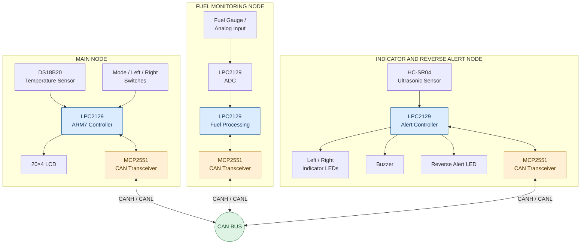
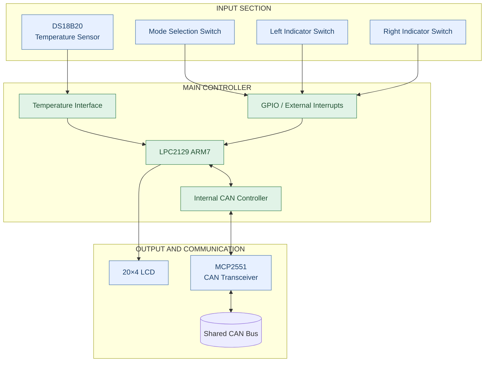
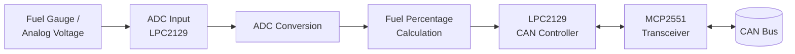
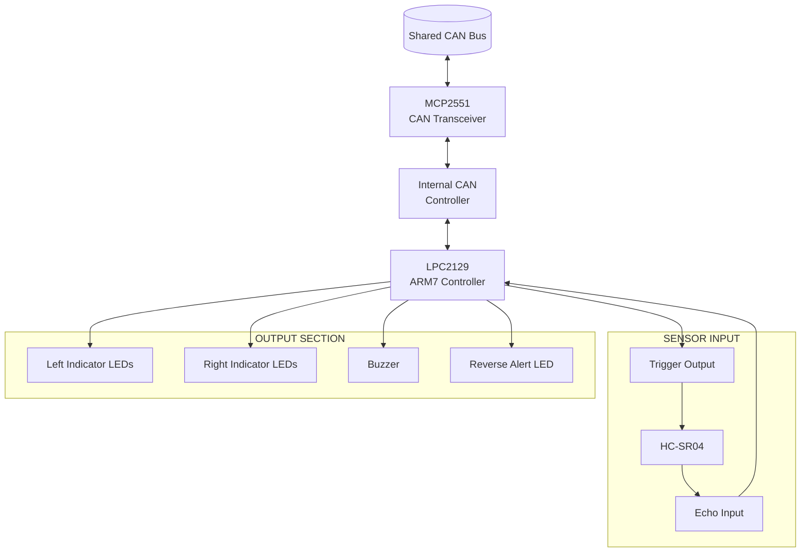
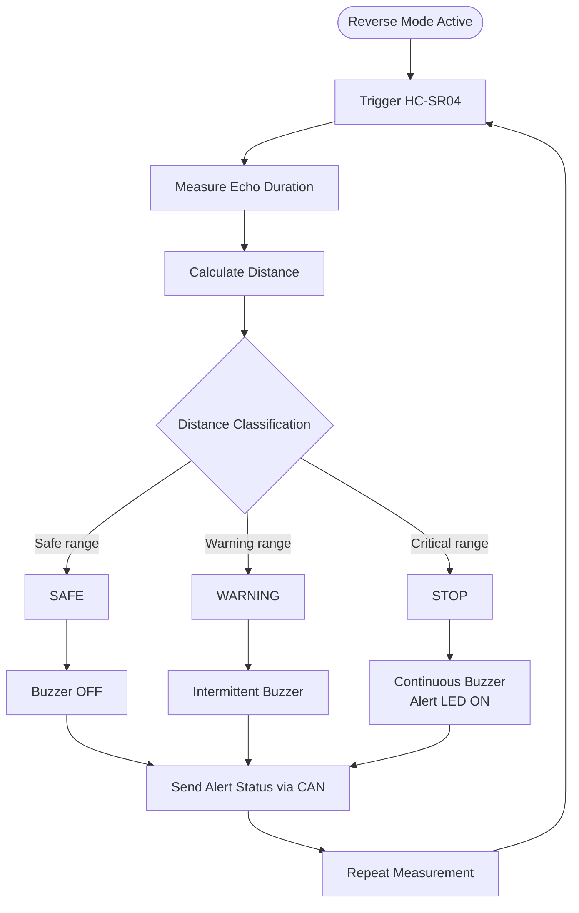
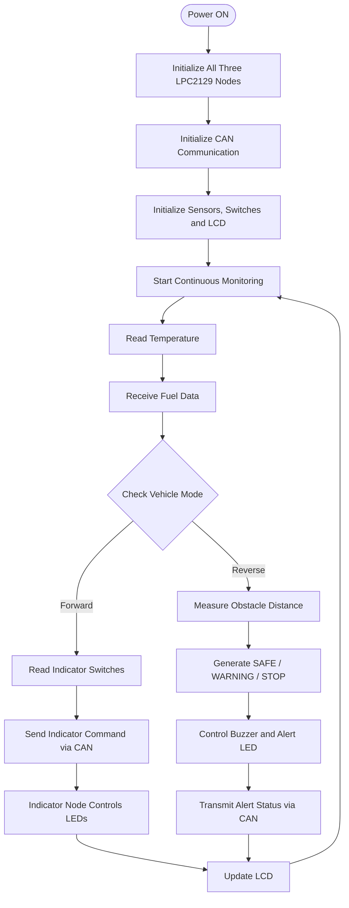

# 🚗 CAN-Driven Vehicle Monitoring and Driver Assistance System

**A Three-Node Embedded Automotive Monitoring System Using LPC2129 and CAN Communication**


## 📌 Project Overview

The **CAN-Driven Vehicle Monitoring and Driver Assistance System** is an embedded automotive prototype designed to monitor important vehicle parameters, manage indicator operations, and assist the driver during reverse parking.

The system is developed using **three LPC2129 ARM7 microcontrollers** connected through a CAN (Controller Area Network) bus.

It monitors engine temperature and fuel level, controls left and right indicators, and detects nearby obstacles during reverse operation using an ultrasonic sensor. The main controller displays the received information on a 20×4 LCD.

### Key Features

* 🌡️ Engine temperature monitoring using DS18B20.
* ⛽ Fuel level measurement using an ADC.
* 🔗 Communication between three controllers using CAN.
* 🚦 Left and right indicator control.
* 📡 Ultrasonic-based reverse obstacle detection.
* 🔊 Buzzer-based distance warning.
* 💡 Visual reverse-alert indication.
* 🖥️ Real-time monitoring using a 20×4 LCD.

---

## 🏗️ 1. Overall System Architecture

The system is divided into three independent embedded nodes. Each node performs a specific task and exchanges relevant information through a shared CAN bus.



### Architecture Explanation

| Node                             | Hardware                                 | Main responsibility                                                  |
| -------------------------------- | ---------------------------------------- | -------------------------------------------------------------------- |
| Main Node                        | LPC2129, DS18B20, switches, LCD, MCP2551 | Central monitoring, mode control, indicator commands and LCD display |
| Fuel Node                        | LPC2129, analog fuel input, MCP2551      | Fuel measurement, ADC conversion and CAN transmission                |
| Indicator and Reverse Alert Node | LPC2129, HC-SR04, LEDs, buzzer, MCP2551  | Indicator control and reverse obstacle detection                     |

**CAN connection:** Each LPC2129's internal CAN controller communicates with an external MCP2551 transceiver. The transceivers connect the three nodes to the shared CANH and CANL bus.

---

## 🔌 2. Main Node Hardware Block Diagram

The Main Node acts as the central controller and display unit.



### Main Node Working

1. The microcontroller initializes GPIO, CAN, LCD and sensor interfaces.
2. The DS18B20 provides engine-temperature readings.
3. Switch inputs are monitored to identify vehicle mode and indicator requests.
4. The Main Node receives fuel information from the Fuel Node.
5. It sends mode and indicator commands to the Indicator and Reverse Alert Node.
6. During reverse mode, it receives obstacle-alert status from the other node.
7. The LCD is refreshed with the current temperature, fuel percentage, mode and reverse status.

---

## ⛽ 3. Fuel Node Hardware Block Diagram

The Fuel Node is responsible for measuring the fuel level and sending the calculated percentage to the Main Node.



### Fuel Node Working

1. Initialize the ADC and CAN interfaces.
2. Read the analog fuel-level input.
3. Convert the ADC value into a corresponding fuel percentage using the programmed mapping.
4. Send the fuel percentage over CAN.
5. Repeat the measurement and transmission according to the firmware's update logic.

**Important:** The accuracy of the fuel reading depends on the actual sensor characteristics and calibration mapping.

---

## 🚦 4. Indicator and Reverse Alert Node Hardware Block Diagram

This node manages the indicator LEDs and reverse obstacle detection.



### Forward Mode

* The node receives indicator commands over CAN.
* It activates the requested left or right indicator sequence.
* The LEDs blink according to the programmed timing.
* When an OFF command is received, the indicator outputs are switched off.

### Reverse Mode

* The node activates the ultrasonic distance-measurement process.
* The HC-SR04 measures the time between the transmitted ultrasonic pulse and the received echo.
* The controller calculates obstacle distance.
* It determines the alert state from the configured distance thresholds.
* The buzzer and reverse-alert LED are controlled accordingly.
* The alert status is transmitted to the Main Node through CAN.

### Distance Alert Logic



The source description identifies 100 cm and 40 cm as the configured distance boundaries. The exact inequalities and boundary handling should be verified in the source code.

---

## 🔄 5. Complete Project Workflow

The following diagram represents the overall system sequence from initialization to monitoring.



### Communication Flow Between Nodes

| Sender                           | Receiver                         | Information                 |
| -------------------------------- | -------------------------------- | --------------------------- |
| Fuel Node                        | Main Node                        | Fuel percentage             |
| Main Node                        | Indicator and Reverse Alert Node | Mode and indicator commands |
| Indicator and Reverse Alert Node | Main Node                        | Reverse-alert status        |

CAN communication allows each node to exchange information using CAN identifiers and message frames.

---

## 🧰 6. Hardware Requirements

| Component                   |    Quantity | Purpose                        |
| --------------------------- | ----------: | ------------------------------ |
| LPC2129 Development Board   |           3 | Processing for the three nodes |
| MCP2551 CAN Transceiver     |           3 | CAN physical-layer interface   |
| 20×4 LCD                    |           1 | Central monitoring display     |
| DS18B20 Temperature Sensor  |           1 | Temperature measurement        |
| HC-SR04 Ultrasonic Sensor   |           1 | Obstacle detection             |
| Fuel Gauge / Analog Input   |           1 | Fuel-level measurement         |
| Indicator LEDs              | As required | Left and right indicators      |
| Reverse Alert LED           |           1 | Reverse warning output         |
| Buzzer                      |           1 | Audible alert                  |
| Mode and Indicator Switches |           3 | Mode and indicator inputs      |
| CAN Bus Wiring              | As required | Network connection             |
| Regulated Power Supply      | As required | Board and sensor power         |
| Jumper Wires                | As required | Peripheral connections         |

The MCP2551 interfaces to the CAN controller and bus. Check the transceiver voltage, MCU logic compatibility and board-specific wiring before connecting the system.

## 💻 7. Software Requirements

* **Programming Language:** Embedded C
* **Microcontroller:** LPC2129 (ARM7)
* **IDE:** Keil µVision
* **Compiler:** Compatible ARM toolchain
* **Programming Tool:** Flash Magic
* **Communication Protocol:** CAN
* **Peripheral Interfaces:** GPIO, ADC, external interrupts, sensor interfaces and LCD

## 🛠️ 8. Implementation Procedure

1. Create three separate firmware projects.
2. Configure the LPC2129 clock and peripheral interfaces.
3. Test the LCD display independently.
4. Test temperature measurement using DS18B20.
5. Test ADC conversion and fuel-level mapping.
6. Configure and test external interrupts for switch inputs.
7. Test HC-SR04 distance measurement.
8. Implement CAN frame transmission and reception.
9. Integrate the Fuel Node with the Main Node.
10. Integrate the Indicator and Reverse Alert Node.
11. Verify the forward and reverse operating modes.
12. Test the complete three-node system and document the results.

## 🧪 9. Testing and Validation

| Test                    | Expected behavior                                 |
| ----------------------- | ------------------------------------------------- |
| LCD test                | Displays text and numeric values                  |
| Temperature sensor test | Provides a readable temperature measurement       |
| ADC test                | ADC reading changes with analog input             |
| Fuel calculation test   | Converts ADC input into the programmed percentage |
| CAN communication test  | Correct data is received by the intended node     |
| Switch test             | Mode and indicator requests are detected          |
| Forward mode test       | Requested indicator LEDs operate                  |
| Reverse mode test       | Ultrasonic distance is measured                   |
| Warning test            | Buzzer and alert state respond to obstacle range  |
| Integrated system test  | Dashboard and alert information update correctly  |

The expected behaviors are functional targets. Actual accuracy, timing and reliability should be established through measurements.

## 📷 10. Hardware Implementation

The physical prototype consists of three LPC2129 development boards interconnected using jumper wires and CAN transceivers.

The hardware setup includes:

* A central LCD for vehicle information.
* A temperature sensor interface.
* A fuel-level measurement input.
* Indicator LED connections.
* An ultrasonic obstacle-detection module.
* A buzzer and visual alert output.

To display your actual prototype photos, upload them into an `images` folder in your repository and add the following section, changing the filenames to match your uploaded images.

```markdown
## Hardware Setup


## LCD Output


```

## 🚀 11. Future Enhancements

* CAN bus error monitoring and node timeout detection.
* Sensor disconnection detection.
* Fuel-level calibration and improved measurement accuracy.
* Ultrasonic reading filtering.
* Data logging for fuel and temperature.
* Additional vehicle diagnostics.
* Wireless monitoring and IoT dashboard integration.
* More extensive hardware validation under different operating conditions.

## 📚 12. Learning Outcomes

* ARM7 LPC2129 microcontroller programming.
* Embedded C development.
* ADC and GPIO interfacing.
* External interrupt handling.
* CAN bus communication.
* Temperature and ultrasonic sensor interfacing.
* Multi-node embedded architecture.
* Real-time data monitoring.
* Hardware integration and debugging.

---

## Project Information

| Category               | Details                                                    |
| ---------------------- | ---------------------------------------------------------- |
| Project                | CAN-Driven Vehicle Monitoring and Driver Assistance System |
| Domain                 | Embedded Systems / Automotive Electronics                  |
| Microcontroller        | LPC2129 ARM7                                               |
| Programming Language   | Embedded C                                                 |
| Communication Protocol | CAN                                                        |
| CAN Transceiver        | MCP2551                                                    |
| Development IDE        | Keil µVision                                               |
| Programming Tool       | Flash Magic                                                |
| Project Type           | Academic Embedded Systems Prototype                        |

**Disclaimer:** This is an educational prototype. It is not a certified automotive control or collision-prevention system and must not be used as a replacement for production vehicle safety systems.
